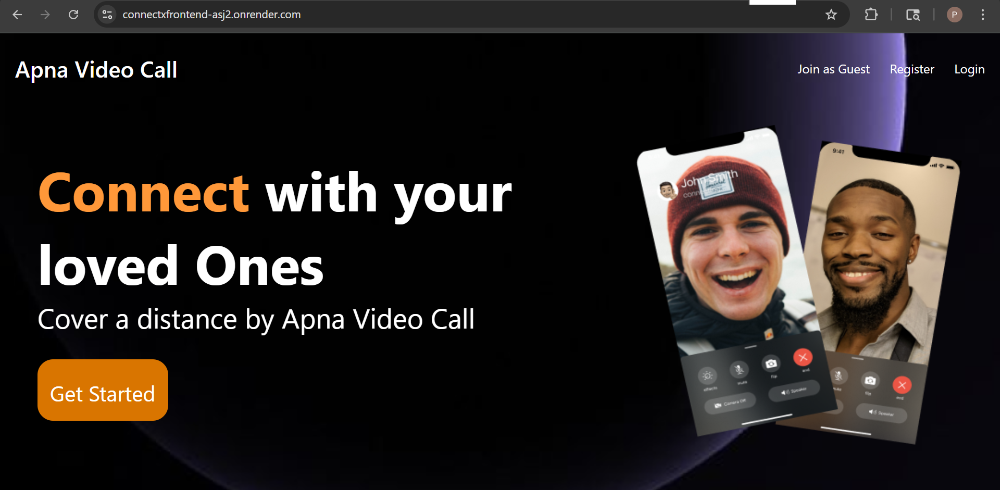
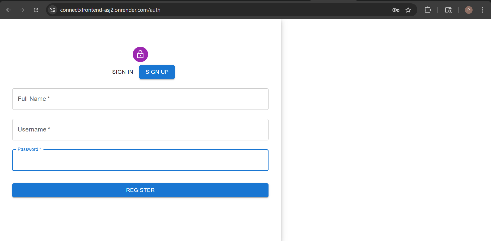
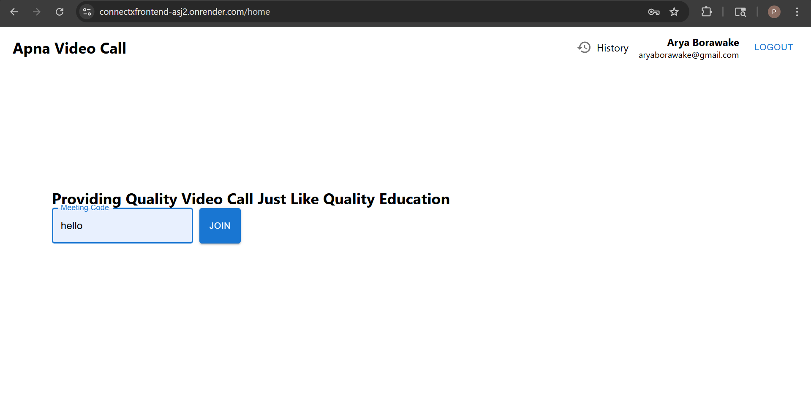
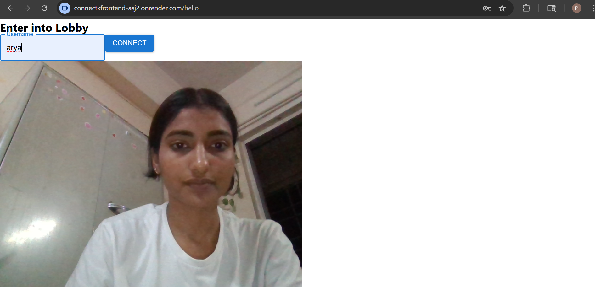
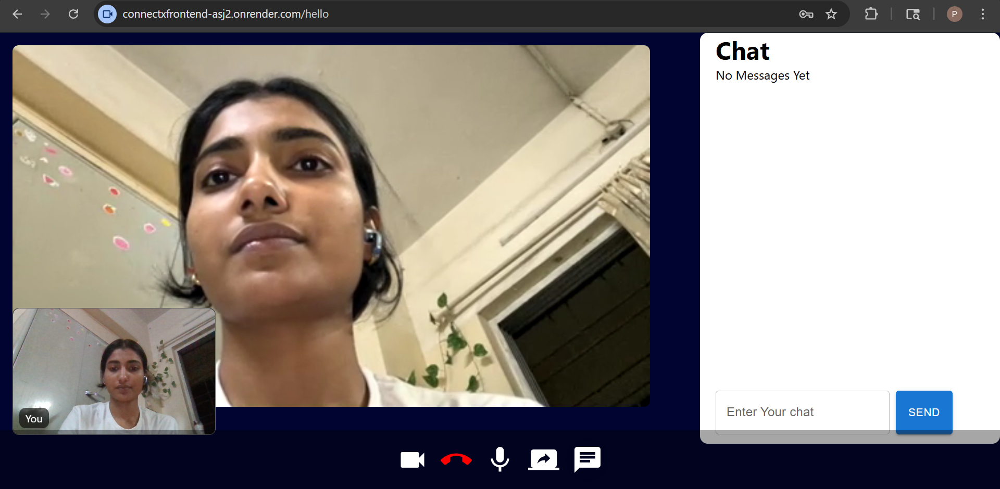
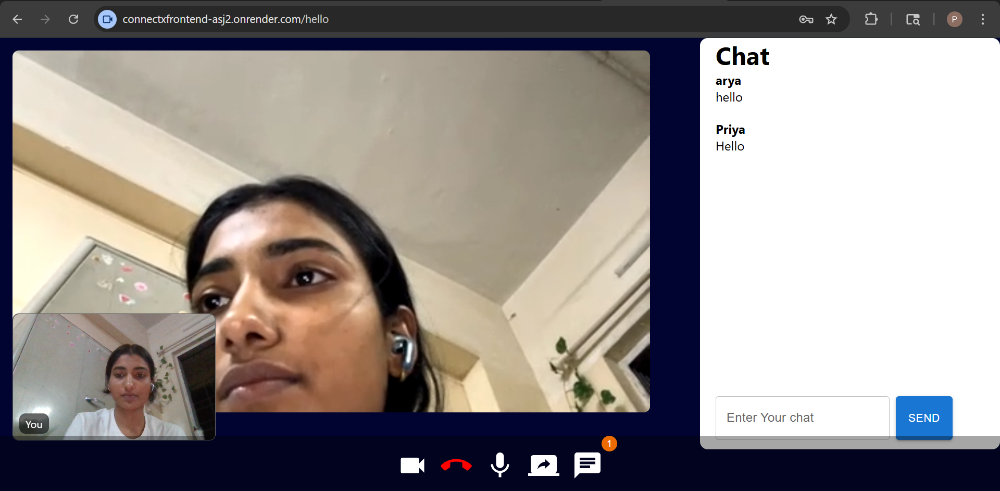
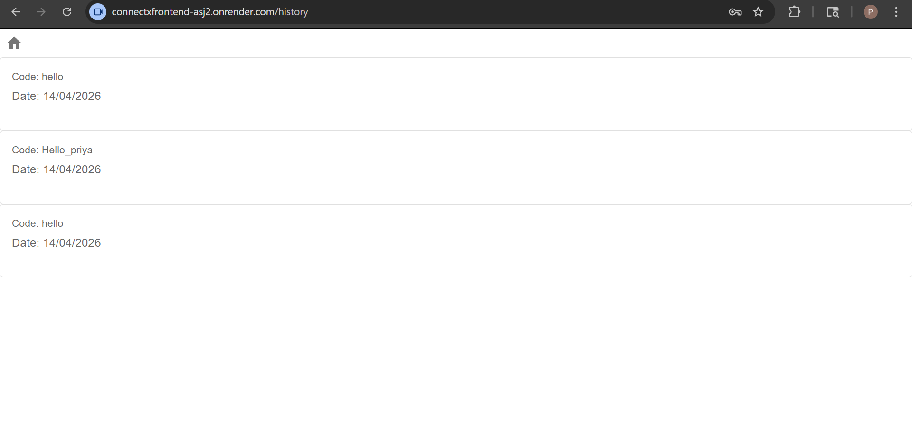

ConnectX – Real-Time Video Conferencing App

ConnectX is a full-stack real-time video conferencing web application that enables users to connect, communicate, and collaborate seamlessly using modern web technologies.

Features
User Authentication (bcrypt)
Real-time Video & Audio Calling (WebRTC)
Screen Sharing
In-call Chat System
Mute / Video Toggle Controls
Join via Unique Meeting Codes
Meeting History Tracking
Low-latency communication using Socket.IO
Tech Stack

Frontend:

React (Vite)
Material UI

Backend:

Node.js
Express.js

Database:

MongoDB Atlas

Real-Time & Communication:

WebRTC
Socket.IO

Authentication:

bcrypt

Deployment:

Render

Architecture Overview
WebRTC handles peer-to-peer media streaming
Socket.IO acts as a signaling server
REST APIs manage authentication and meeting data
MongoDB stores user profiles and meeting history

Screenshots (Add yours)

Installation & Setup
git clone https://github.com/Sociallypriya/ConnectX
cd ConnectX

# Backend
cd backend
npm install
nodemon src/app.js

# Frontend
cd frontend
npm install
npm run dev

Environment Variables

Create .env in backend:

MONGO_URI=your_mongodb_uri
JWT_SECRET=your_secret

Future Improvements
Group video optimization (SFU)
Recording feature
Notifications system
Mobile responsiveness enhancement

Author
Priya Kumari
